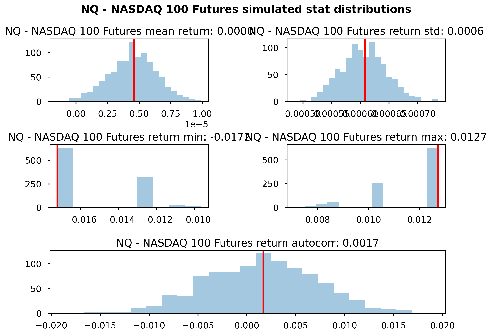
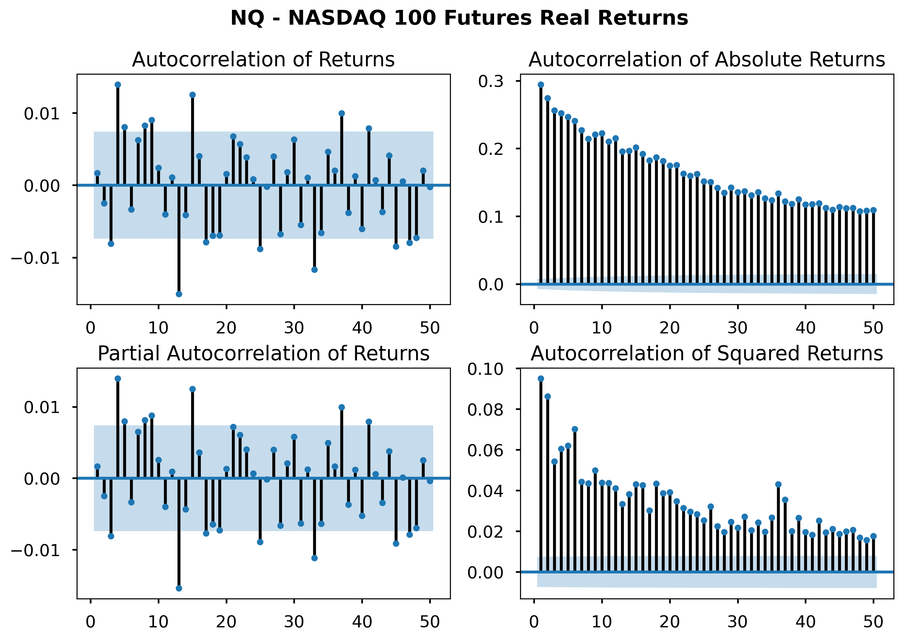
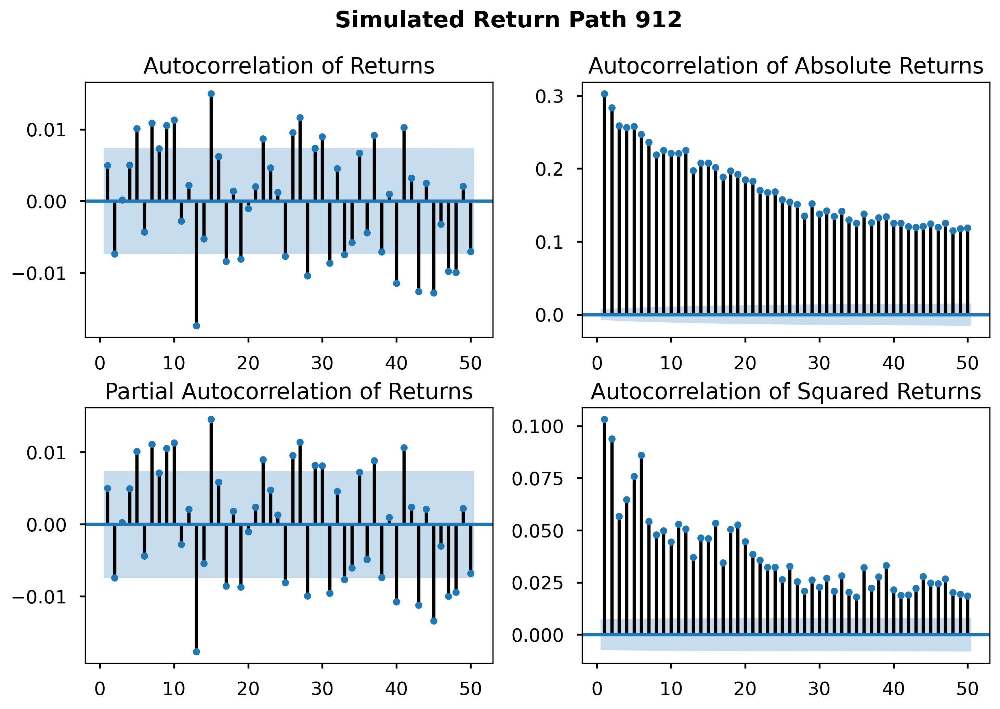
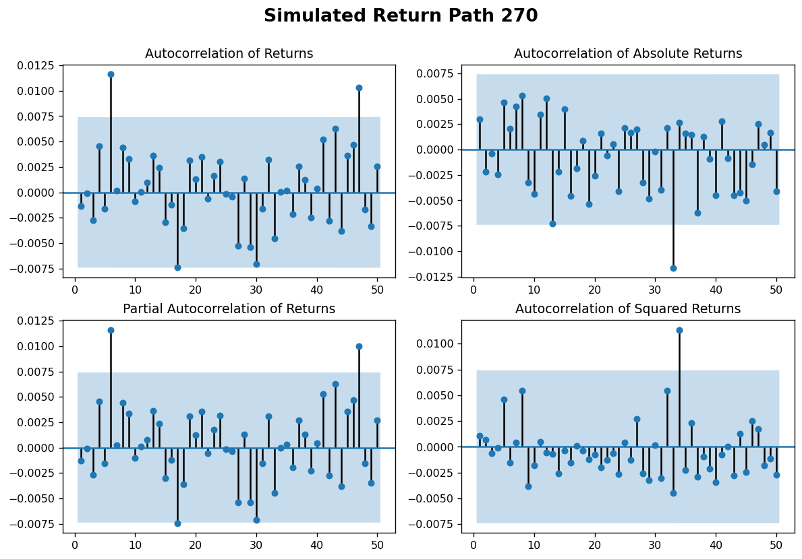
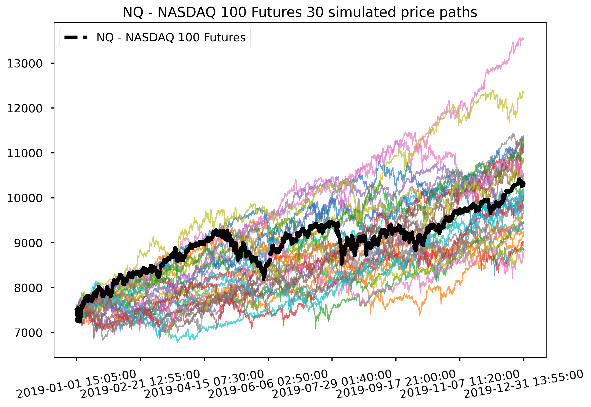
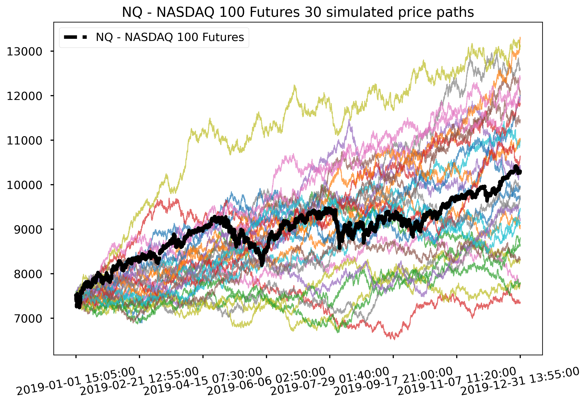

Bootstrap Price Time Series 
==============================

This repo demonstrates a few time series bootstrap methods to synthesize price/return paths for robustness simulation.

## Methods to Synthesize Simulation Data

### Parametric model
* Requires parsimonious trade-off between fitting error and model complexity.
* Requires assumptions.

### Traditional i.i.d. bootstrapping: resampling history with replacement
* Serial correlation bias in momentum: returns are not independently distributed and tend to be persistent for a stretch.
* Underlying: Anchoring effect / cognitive bias / disposition effect
* Volatility clustering

### Block bootstrapping: preserve return autocorrelation
* Sampling histories from blocks of time
* Moving Block Bootstrapping (MBB): Beginning and ending points of blocks are underrepresented.
* Circular Block Bootstrapping (CBB)
* Python: arch, recombinator
* Block length as a hyper parameter

## Summary Statistics on Original Real Price Data

## Comparing ACF and PACF of the Original and Synthesized Data
#### ACF & PACF of Real Return Data

ACF & PACF by CBB              |  ACF & PACF by i.i.d. Bootstrap
:-----------------------------:|:--------------------------------------------:
 | 

## Price Paths from Synthesized Data
Synthesized Price Path by CBB  |  Synthesized Price Path by i.i.d. Bootstrap
:-----------------------------:|:--------------------------------------------:
 | 

## Future research:
* Block bootstrap across correlated assets or asset classes.
* Mixture models for generating paths.
